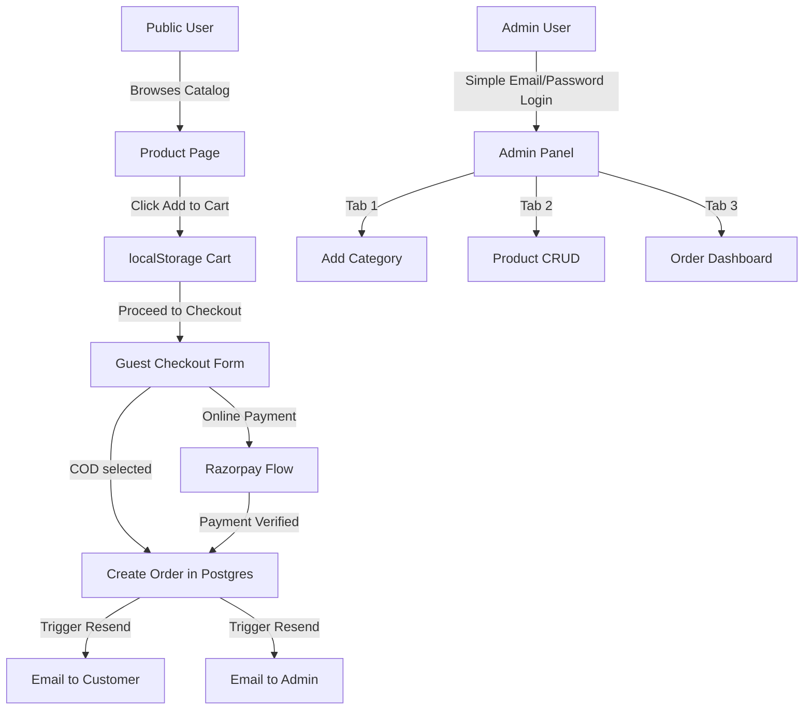

# Welcona eCommerce — 35k Simplified Plan Implementation Guide

This document defines the step-by-step technical plan to refactor the **Welcona eCommerce** application from the full 95k version to the simplified 35k version. This transition centers around removing complex user authentication/management, replacing server-side sessions with a guest-first `localStorage` flow, disabling Redis-based OTP systems, and narrowing the administration panel down to three vital workflows: **Category Management**, **Product Catalog**, and **Order Processing**.

---

## 1. Architectural Shifts



### Core Architecture Goals:
1. **No User Accounts / Login**: Users browse and purchase without an account.
2. **Client-Side Cart**: Stored entirely in browser `localStorage`.
3. **Admin Panel Simplification**: Password-only login (no Redis OTP). Three tabs: Add Category, Product Management, and Orders.
4. **Guest Checkout Form**: Collect customer information (Name, Email, Phone, Address) at checkout.
5. **Dual Payment Options**: Offline Cash on Delivery (COD) and Online (Razorpay).
6. **Transactional Emails**: Automatic emails on purchase using Resend (Summary to Customer, Notification to Admin).
7. **Absolute Simplicity**: Strip out sitemaps, `manifest.json`, `robots.txt`, complex SEO pipelines, and Wholesale/Bulk logic.

---

## 2. Database Schema & Migration (`prisma/schema.prisma`)

We will restructure the database to completely remove user profiles, reviews, notifications, and server-side carts. The `Order` table will be redesigned to store guest customer contact and shipping details inline.

### Proposed `schema.prisma`
```prisma
generator client {
  provider = "prisma-client-js"
}

datasource db {
  provider = "postgresql"
  url      = env("DATABASE_URL")
}

// ─── ADMIN MODEL (PASSWORD ONLY, NO ROLES) ──────────────────────────────────
model Admin {
  id        String   @id @default(uuid())
  email     String   @unique
  fullName  String?
  password  String   // Hashed with bcrypt
  createdAt DateTime @default(now())
  updatedAt DateTime @updatedAt
}

// ─── PRODUCT CATEGORY ────────────────────────────────────────────────────────
model Category {
  id          String    @id @default(uuid())
  name        String
  image       String?
  description String?
  createdAt   DateTime  @default(now())
  updatedAt   DateTime  @updatedAt
  products    Product[]
}

// ─── PRODUCT CATALOG (REMOVED RATING & WHOLESALE MIN QTY LOGIC) ──────────────
model Product {
  id           String         @id @default(uuid())
  quantity     Int            // Inventory Stock
  sku          String         @unique
  name         String
  images       ProductImage[]
  warranty     String?
  description  String?
  finish       String?        // e.g., "Chrome", "Stainless Steel"
  material     String?        // e.g., "Brass"
  retailPrice  Float
  discount     Float?         // Discount percentage or raw difference
  categoryId   String
  category     Category       @relation(fields: [categoryId], references: [id], onDelete: Restrict)
  orderItems   OrderItem[]
  tags         String[]
  createdAt    DateTime       @default(now())
  updatedAt    DateTime       @updatedAt
}

model ProductImage {
  id        String   @id @default(uuid())
  productId String
  index     Int      @default(0)
  isPrimary Boolean  @default(false)
  image     String   // Image URL (Supabase bucket)
  product   Product  @relation(fields: [productId], references: [id], onDelete: Cascade)
  createdAt DateTime @default(now())
  updatedAt DateTime @updatedAt
}

// ─── SIMPLIFIED ORDERS (STORES GUEST DETAILS INLINE) ────────────────────────
model Order {
  id              String        @id @default(uuid())
  customerName    String
  customerEmail   String
  customerPhone   String
  shippingAddress String        // Single aggregated address block or serialized JSON
  total           Float
  paymentStatus   PaymentStatus @default(PENDING)
  paymentMethod   PaymentMethod
  
  // Razorpay payment tracking
  razorpayOrderId   String?
  razorpayPaymentId String?

  status     OrderStatus @default(PENDING)
  orderItems OrderItem[]
  createdAt  DateTime    @default(now())
  updatedAt  DateTime    @updatedAt
}

enum PaymentMethod {
  CASH_ON_DELIVERY
  ONLINE
}

enum PaymentStatus {
  PENDING
  COMPLETED
  FAILED
  REFUNDED
}

enum OrderStatus {
  PENDING    // Unapproved (especially COD)
  CONFIRMED  // Confirmed/Accepted by Admin
  SHIPPED
  DELIVERED
  CANCELLED  // Rejected or Cancelled by Admin
}

model OrderItem {
  id        String   @id @default(uuid())
  orderId   String
  order     Order    @relation(fields: [orderId], references: [id], onDelete: Cascade)
  productId String
  product   Product  @relation(fields: [productId], references: [id])
  quantity  Int
  price     Float    // Snapshot of price at the time of purchase
  createdAt DateTime @default(now())
  updatedAt DateTime @updatedAt
}
```

> [!NOTE]
> When applying these schema edits, we will delete the existing Prisma migrations, run `npx prisma db push` or create a clean baseline migration via `npx prisma migrate dev --name init_35k_schema` to rebuild the PostgreSQL database correctly.

---

## 3. Session & Authentication Simplification

Since there is no User auth or OTP verification required:
1. **Redis Decommissioning**: We will completely remove `lib/redis.ts`, `lib/otp.ts`, and all references to OTPs in server actions. Redis will no longer be an environment dependency.
2. **Delete User Registration Pages**:
   - `app/(users)/login` (replace with client-side landing/guest cart or redirect to custom Admin-only login page).
   - `app/(users)/signup` (deleted).
   - `app/(users)/forgot-password` (deleted).
   - `app/(users)/dashboard` (deleted).
3. **Simple Admin Credentials Authentication**:
   - Refactor `lib/actions/admin-auth.ts` to perform a single-step login:
     ```typescript
     export async function adminLoginAction(email: string, password?: string) {
       const admin = await prisma.admin.findUnique({ where: { email } });
       if (!admin) return { error: "Invalid credentials." };
       
       const valid = await bcrypt.compare(password, admin.password);
       if (!valid) return { error: "Invalid credentials." };
       
       const token = await signToken({
         sub: admin.id,
         email: admin.email,
         role: "admin"
       });
       
       const cookieStore = await cookies();
       cookieStore.set(COOKIE_NAME, token, {
         httpOnly: true,
         secure: process.env.NODE_ENV === "production",
         sameSite: "lax",
         maxAge: 60 * 60 * 24, // 24 hours
         path: "/",
       });
       return { success: true };
     }
     ```
4. **Middleware Adaptation (`middleware.ts`)**:
   - Protect `/admin/*` routes. Redirect unauthenticated users navigating to `/admin` straight to `/admin/login` (instead of standard user login page).
   - Standard users browse all pages `/` and `/products/*` as open public routes without checking for cookies.

---

## 4. Client-Side Cart Logic (`localStorage`)

We will transition the shopping cart from the database model to the browser's sandbox.

### State Store Structure (`localStorage`)
The cart will be persisted as an array of items:
```json
[
  { "productId": "uuid-here", "quantity": 1 }
]
```

### Components to Update:
* **`components/users/CartIndicator.tsx`**: Update this client component to read from `localStorage` on mount (`useEffect` to bypass Next.js SSR hydration mismatch) and display the cumulative quantity of products currently in the cart.
* **`components/users/ProductDetailsClient.tsx`**: Replace the server actions for cart addition with a simple React callback:
  ```typescript
  const addToCart = (productId: string, quantity: number = 1) => {
    const existing = localStorage.getItem("welcona_cart");
    let cart = existing ? JSON.parse(existing) : [];
    const index = cart.findIndex((item: any) => item.productId === productId);
    if (index > -1) {
      cart[index].quantity += quantity;
    } else {
      cart.push({ productId, quantity });
    }
    localStorage.setItem("welcona_cart", JSON.stringify(cart));
    // Dispatch a custom event to sync CartIndicator
    window.dispatchEvent(new Event("cart-updated"));
  };
  ```

---

## 5. Checkout & Payment Integration Plan

The user flows smoothly from viewing their cart to the guest checkout form.

```
+-------------------------------------------------------------+
|                     GUEST CHECKOUT INFO                     |
|                                                             |
|  Full Name:      [ John Doe                               ] |
|  Email Address:  [ john@example.com                       ] |
|  Phone Number:   [ +91 98765 43210                        ] |
|  Shipping Addr:  [ 123 Luxury Apartments, Mumbai, 400001  ] |
|                                                             |
|  Select Payment Mode:                                       |
|  (o) Cash on Delivery (COD)      ( ) Pay Online (Razorpay)   |
|                                                             |
|                         [ PLACE ORDER ]                     |
+-------------------------------------------------------------+
```

### Order Placement API (`/api/checkout`)
The frontend will POST the payload directly:
```json
{
  "customerName": "John Doe",
  "customerEmail": "john@example.com",
  "customerPhone": "9876543210",
  "shippingAddress": "123 Main St, Apartment 4B, Mumbai, MH - 400001",
  "paymentMethod": "CASH_ON_DELIVERY", // or "ONLINE"
  "cartItems": [
    { "productId": "prod-uuid", "quantity": 2 }
  ],
  "razorpayPaymentId": "pay_xyz" // optional, passed on verified online payment
}
```

### Checkout Logic In-Depth:
1. **COD Order Creation**:
   - The backend validates the inputs.
   - Computes total value based on actual database product prices (never trust prices from frontend).
   - Creates the `Order` record with `paymentMethod: "CASH_ON_DELIVERY"`, `paymentStatus: "PENDING"`, and `status: "PENDING"`.
   - Sends emails through **Resend** (Order receipt to client, Order action alert to Admin).
   - Returns a successful response. The frontend clears the `localStorage` and redirects to `/order-success?id=ORD_ID`.

2. **Online Razorpay Flow**:
   - Keep the existing `razorpay` package connection.
   - When "Pay Online" is clicked, client calls a server-side action to create a **Razorpay Order ID** via backend.
   - Mounts the Razorpay window with the total cost in paise.
   - Once payment completes successfully:
     - Client retrieves the payment credentials (`razorpay_payment_id`, `razorpay_signature`).
     - Frontend submits these credentials along with guest info to `/api/checkout` (with `"paymentMethod": "ONLINE"`).
     - Server verifies the payment signature using the Razorpay secret.
     - Saves order to database with `paymentStatus: "COMPLETED"`, `status: "CONFIRMED"`.
     - Automatically dispatches transactional summary emails to client and admin.
     - Frontend clears cart and redirects to `/order-success`.

---

## 6. Resend Email Notifications (`lib/email.ts`)

Instead of complex logging or multi-channel communications, the application uses **Resend** to send two distinct HTML transactional emails as soon as an order is successfully created in the database.

### 1. Customer Order Summary Email
A premium, responsive HTML email displaying:
* Welcona Branding (minimalist luxury header).
* Order ID (`#${orderId.split("-")[0].toUpperCase()}`).
* Shipping address.
* Clean tabular layout showing Item Name, Qty, Price, and Order Total.
* Note clarifying payment status (e.g. "To be paid via Cash on Delivery" or "Paid Online via Razorpay").

### 2. Admin Alert Email
A brief transactional message sent to the admin email:
```html
<p><strong>A new order has been received!</strong></p>
<ul>
  <li><strong>Order Reference:</strong> #ORD_ID</li>
  <li><strong>Customer Name:</strong> John Doe</li>
  <li><strong>Email:</strong> john@example.com</li>
  <li><strong>Phone:</strong> 9876543210</li>
  <li><strong>Order Total:</strong> ₹18,450</li>
  <li><strong>Payment Method:</strong> CASH_ON_DELIVERY</li>
</ul>
<p>Please log in to the <a href="https://welcona.com/admin/orders">Admin Panel</a> to confirm or fulfill this order.</p>
```

---

## 7. Admin Panel Reorganization

We will customize the admin views and layouts (`app/admin/*` and `components/admin/*`) to restrict tabs and navigation controls.

### The Three Admin Workflow Tabs:

```
+-----------------------------------------------------------+
| WELCONA ADMIN                                             |
+-------------------+---------------------------------------+
|  [+] Categories   |  ADD NEW CATEGORY                     |
|  [x] Products     |  Category Name:  [               ]    |
|  [o] Orders       |  Image Upload:   [ Browse... ]        |
|                   |  Description:    [               ]    |
|  [ Logout ]       |                                       |
|                   |  [ SAVE CATEGORY ]                    |
+-------------------+---------------------------------------+
```

1. **Category Management (`/admin/categories`)**:
   - Allows admin to add a new category (Name, Description, image file upload to Supabase storage bucket).
   - Display a basic list/table of active categories.
2. **Product Catalog Management (`/admin/products`)**:
   - Existing product CRUD interface showing Name, SKU, Category selection, retailPrice, discount, description, warranty, finish, material, stock quantity, and product image uploads.
   - *Removed fields*: wholesalePrice, wholesaleMinQuantity.
3. **Order Dashboard (`/admin/orders`)**:
   - List view showing ID, Date, Customer Name, Total, Payment Method, Payment Status, and Fulfillment Status.
   - Detail view:
     - Shows all products purchased and shipping information.
     - **Accept / Reject buttons for COD**: Admin clicks "Accept" to change status to `CONFIRMED` or "Reject" to change status to `CANCELLED`.
     - Simple order status transitions: `PENDING` -> `CONFIRMED` -> `SHIPPED` -> `DELIVERED`.

> [!IMPORTANT]
> The admin page links to "Users", "Admins Management", "Ratings/Reviews Review", or "Wholesale parameters" will be completely commented out or deleted from the sidebar component (`Sidebar.tsx` / `AdminLayout`).

---

## 8. Frontend Cleanup & Simplification

To fulfill the "keep very very simple" requirement, we will strip away all complex configuration files, sitemaps, indexing files, PWA descriptors, and user review modules.

### Deletions
* **PWA & Icons**: Delete `app/manifest.ts` or `manifest.json`. Delete Apple/iOS specific icon generation assets if they add bundle overhead.
* **SEO Documents**: Delete `app/sitemap.ts` (or `sitemap.xml`) and `app/robots.ts` (or `robots.txt`).
* **Open Graph / Dynamic Metadata**: Remove dynamic OG metadata generating wrappers. Replace layout meta components with pure static strings in root pages.
* **Review Section**: Remove `components/users/ReviewsSection.tsx`, `components/users/ReviewsDisplay.tsx`, and `components/users/ReviewForm.tsx` from the product detail page. Products will display basic information and imagery, without ratings/comments from anonymous users.

### Product Page Catalog Filtering Simplification
* **Remove advanced filters**: Eliminate sidebar criteria like price ranges, rating stars, material grids, color groups, and multi-sort toggles.
* **Simple filter**: Install a simple text search bar (by name or SKU) and a category filter dropdown at the top of the products display.
* **Homepage basic features**: Keep simple, static filter carousels/sections for "Best Discount", "By Category", and standard listings.

---

## 9. Migration & Step-by-Step Transition Plan

| Step | Action Item | Affected Files | Expected Time |
| :--- | :--- | :--- | :--- |
| **1** | Rewrite database schema and drop tables | `prisma/schema.prisma` | 30 mins |
| **2** | Deploy schema & seed baseline admin user | `prisma/seed.ts` | 15 mins |
| **3** | Update JWT token config and purge Redis | `lib/session.ts`, `lib/redis.ts`, `lib/otp.ts` | 30 mins |
| **4** | Refactor Admin authentication and update edge checks | `lib/actions/admin-auth.ts`, `middleware.ts` | 45 mins |
| **5** | Clean Admin layout, limit sidebar to 3 tabs | `app/admin/layout.tsx`, `app/admin/page.tsx` | 30 mins |
| **6** | Implement Client-Side Cart handler (`localStorage`) | `components/users/ProductDetailsClient.tsx` | 45 mins |
| **7** | Create Guest Checkout Form page & Order placement API | `app/(users)/checkout/page.tsx`, `app/api/checkout/route.ts` | 1 hour |
| **8** | Revamp Resend actions (dual email notifications) | `lib/email.ts` | 30 mins |
| **9** | Strip out SEO files, manifest descriptor, sitemaps | `app/manifest.ts`, `app/sitemap.ts`, `app/robots.ts` | 15 mins |
| **10**| Clean catalog layout (remove ratings, review components) | `components/users/ProductCatalogClient.tsx` | 45 mins |

---
*Document prepared under Sarvagya Labs guidelines for Welcona Baths. Pricing and deliverables are governed by Plan 2 Basic guidelines.*
