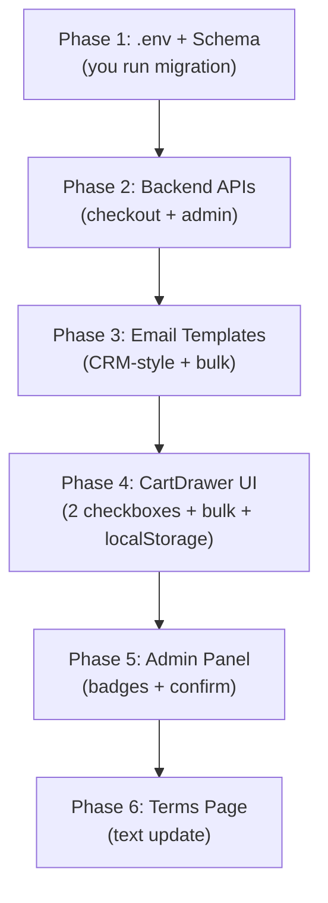

# Welcona — Delivery + Bulk Order Reconstruction Plan (v3)

> **Goal:** Remove fixed delivery charges, use WhatsApp as CRM (customer must discuss delivery BEFORE payment), two mandatory checkboxes, bulk order threshold with WhatsApp payment, save order IDs to localStorage. All configurable via env.

---

## 💡 Core Business Logic

- **Welcona sells products. We don't handle delivery logistics.**
- **WhatsApp = our CRM.** Customer MUST contact us on WhatsApp to discuss delivery BEFORE they pay. This is mandatory — not optional.
- **Two checkboxes required before payment:**
  1. ✅ "I agree to Terms & Conditions"
  2. ✅ "I confirm I have discussed and understood delivery arrangements via WhatsApp"
- **Delivery options are informational only** — no charges calculated in our system:
  - **Customer Pickup:** Come to shop, pick up.
  - **Home Delivery:** We arrange via third-party courier. Customer pays delivery person directly. But they must discuss this with us on WhatsApp first.
- **Every order → customer contacts us.** Order ID saved to localStorage for reference.
- **No user accounts** — guest checkout, localStorage is the receipt.

---

## 🔄 Customer Flow (Before → After)

### Before (Current):
```
Browse → Add to Cart → Choose Delivery (Delhi ₹150 / Outside ₹250) 
→ Fill Details → Check T&C → Pay via Razorpay → Done
```

### After (New):
```
Browse → Add to Cart → See Delivery Options → 
Contact us on WhatsApp to discuss delivery →
Fill Details → Check ✅ T&C + ✅ Delivery Confirmed →
Pay (Razorpay if <₹10k / WhatsApp if ≥₹10k) → 
Order ID saved to browser → Done
```

---

## 📊 Current State → Target State

| Aspect | Current | Target |
|--------|---------|--------|
| **Delivery Options** | `DELHI` (₹150), `OUTSIDE_DELHI` (₹250), `CUSTOMER_PICKUP` | `CUSTOMER_PICKUP` (FREE), `HOME_DELIVERY` (no charge — arranged separately) |
| **Delivery Charge** | Calculated and added to total | **Removed entirely** — we don't handle delivery fees |
| **Pre-payment CRM** | ❌ None | ✅ WhatsApp CRM — customer must contact us before paying |
| **Checkboxes** | 1 checkbox (T&C only) | **2 checkboxes:** T&C + "I confirmed delivery via WhatsApp" |
| **Payment Methods** | `ONLINE` only | `ONLINE` (under ₹10k) + `WHATSAPP` (bulk ≥ ₹10k) |
| **Order ID Storage** | Not saved client-side | Saved to localStorage for ALL orders |
| **Email** | References Delhi/Outside Delhi + delivery charges | CRM-style: "Order #XXXX — contact us on WhatsApp", no delivery charges shown |
| **Admin Panel** | Generic | Bulk badges, confirm button, delivery badge |
| **Terms Page** | Delhi ₹150, Outside Delhi ₹250 | Pickup + Home Delivery (contact us, pay delivery boy) |

---

## 📁 Files That Need Changes (12 files)

### Phase 1 — Foundation (Schema + Env)

| # | File | Change |
|---|------|--------|
| 1 | [.env](file:///home/kushkumarkashyap7280/Desktop/welcona/welcona-35k/.env) | Add `BULK_ORDER_THRESHOLD`, `NEXT_PUBLIC_BULK_THRESHOLD`, `WHATSAPP_NUMBER`, `WHATSAPP_BULK_MESSAGE` |
| 2 | [schema.prisma](file:///home/kushkumarkashyap7280/Desktop/welcona/welcona-35k/prisma/schema.prisma) | `DeliveryOption`: remove `DELHI`/`OUTSIDE_DELHI`, add `HOME_DELIVERY`. `PaymentMethod`: add `WHATSAPP` |

> [!IMPORTANT]
> I will modify the schema and give you the migration command. **You run it yourself:**
> ```bash
> npx prisma migrate dev --name "bulk_order_whatsapp_delivery_update"
> npx prisma generate
> ```

### Phase 2 — Backend APIs

| # | File | Change |
|---|------|--------|
| 3 | [checkout/razorpay/route.ts](file:///home/kushkumarkashyap7280/Desktop/welcona/welcona-35k/app/api/checkout/razorpay/route.ts) | Remove delivery charges. Accept `CUSTOMER_PICKUP`/`HOME_DELIVERY`. Add bulk guard. |
| 4 | [checkout/route.ts](file:///home/kushkumarkashyap7280/Desktop/welcona/welcona-35k/app/api/checkout/route.ts) | Remove delivery charges. Add bulk path (PENDING, WHATSAPP, no stock deduction). Require `deliveryConfirmed: true` in request body. |
| 5 | [admin/orders/route.ts](file:///home/kushkumarkashyap7280/Desktop/welcona/welcona-35k/app/api/admin/orders/route.ts) | PATCH: bulk confirm → atomic stock deduction + confirmation email. |

### Phase 3 — Email Templates

| # | File | Change |
|---|------|--------|
| 6 | [lib/email.ts](file:///home/kushkumarkashyap7280/Desktop/welcona/welcona-35k/lib/email.ts) | Remove delivery charge display. Update labels. Add CRM-style order reference in all emails. Add 3 new bulk email functions. |

### Phase 4 — Frontend Checkout UI

| # | File | Change |
|---|------|--------|
| 7 | [CartDrawer.tsx](file:///home/kushkumarkashyap7280/Desktop/welcona/welcona-35k/components/users/CartDrawer.tsx) | **Biggest change.** New delivery options with WhatsApp CTA. **Two checkboxes.** Bulk detection + golden UI. localStorage save for all orders. |

### Phase 5 — Admin Panel

| # | File | Change |
|---|------|--------|
| 8 | [OrdersClient.tsx](file:///home/kushkumarkashyap7280/Desktop/welcona/welcona-35k/app/admin/orders/components/OrdersClient.tsx) | Bulk badges, delivery label update. |
| 9 | [admin/orders/[id]/page.tsx](file:///home/kushkumarkashyap7280/Desktop/welcona/welcona-35k/app/admin/orders/%5Bid%5D/page.tsx) | Bulk confirm button, delivery badge, CRM info display. |

### Phase 6 — Terms Page

| # | File | Change |
|---|------|--------|
| 10 | [terms/page.tsx](file:///home/kushkumarkashyap7280/Desktop/welcona/welcona-35k/app/%28users%29/terms/page.tsx) | Replace Section 3 with new delivery policy text. |

---

## 🔧 Detailed Changes Per File

### 1. `.env` — New variables

```env
# Bulk order threshold in paise (₹10,000 = 1000000 paise)
BULK_ORDER_THRESHOLD=1000000

# Bulk order threshold in rupees (for frontend display)
NEXT_PUBLIC_BULK_THRESHOLD=10000

# WhatsApp CRM number (with country code, no +)
WHATSAPP_NUMBER=919625711655

# Bulk order WhatsApp message template ({orderId} gets replaced)
WHATSAPP_BULK_MESSAGE=Hi, I have placed a bulk order on Welcona. My Order ID is {orderId}. Please help me complete the payment.
```

### 2. `prisma/schema.prisma`

```diff
 enum DeliveryOption {
   CUSTOMER_PICKUP
-  DELHI
-  OUTSIDE_DELHI
+  HOME_DELIVERY
 }

 enum PaymentMethod {
   ONLINE
+  WHATSAPP
 }
```

### 3. `checkout/razorpay/route.ts`

- **Remove** `DELIVERY_CHARGES` map entirely
- **Validate** delivery option: only `CUSTOMER_PICKUP` or `HOME_DELIVERY`
- **Total = items total only** (no delivery charge)
- **Bulk guard:** if `amountInPaise >= BULK_ORDER_THRESHOLD` → return 400

### 4. `checkout/route.ts` — Two paths

**Regular path (under threshold):**
- Remove delivery charge calculation
- Keep Razorpay signature verification
- Keep atomic stock deduction
- `deliveryCharge: 0` always
- Require `deliveryConfirmed: true` in request body (validates second checkbox)

**Bulk path (when `isBulk === true`):**
- NO Razorpay verification
- Create order: `WHATSAPP`, `PENDING`, `PENDING`, `deliveryCharge: 0`
- Stock NOT touched
- Send bulk emails
- Return `{ orderId, isBulk: true }`

### 5. `admin/orders/route.ts` — Bulk confirm with stock deduction

When PATCH is called for a WHATSAPP order being set to CONFIRMED:
1. `$transaction` with `SELECT FOR UPDATE` → lock product rows
2. Validate stock
3. Deduct stock
4. Set `paymentStatus: "COMPLETED"`, `status: "CONFIRMED"`
5. Send `sendBulkOrderConfirmedEmail()` to customer
6. Return updated order

Regular orders: keep simple update.

### 6. `lib/email.ts` — CRM-style emails

**Label changes:**
```diff
 const DELIVERY_LABELS = {
   CUSTOMER_PICKUP: "Customer Pickup (from shop)",
-  DELHI: "Delhi Delivery",
-  OUTSIDE_DELHI: "Outside Delhi Delivery",
+  HOME_DELIVERY: "Home Delivery (arranged via courier)",
 };
```

**Remove** delivery charge amount from ALL email templates. Show delivery option label only.

**CRM-style info in ALL emails (customer + admin):**
Every email includes:
```
📋 Order Reference
Order ID: #XXXXXX
Contact us on WhatsApp with your Order ID:
💬 wa.me/919625711655

Quick message: "Hi, my order no is #XXXXXX"
```

**3 new functions:**

| Function | When Called | Subject | Special Content |
|----------|-----------|---------|-----------------|
| `sendBulkOrderCustomerEmail()` | Bulk order placed | "Your Welcona Bulk Order is Received! 🏆" | Order ID, WhatsApp CTA: "Hi, my order no is #XXXX, please help me complete payment" |
| `sendBulkOrderAdminEmail()` | Bulk order placed | "🏆 New Bulk Order — #XXXX" | Customer details, "Action Required: Contact customer on WhatsApp to confirm payment" |
| `sendBulkOrderConfirmedEmail()` | Admin confirms bulk | "Order Confirmed ✅ — #XXXX" | "Payment received, your order is being processed. Contact us on WhatsApp with Order ID for delivery updates." |

**Existing `sendPaymentSuccessEmail()` update:**
- Remove delivery charge line
- Add CRM block: "Your Order ID is #XXXX. Contact us on WhatsApp for delivery arrangements or questions."

**Existing `sendAdminOrderNotificationEmail()` update:**
- Remove delivery charge line
- Add delivery option badge: "Customer Pickup" or "Home Delivery — contact customer to arrange"

### 7. `CartDrawer.tsx` — Major overhaul

#### Delivery Options (checkout step):

```
○ Customer Pickup                              FREE
  Pick up from our shop within 7 working
  days (Mon–Sat, 9 AM – 7 PM).

○ Home Delivery                          Arranged separately
  📦 We arrange delivery via third-party courier.
  You pay the delivery person directly.
  
  ⚠️ Please contact us on WhatsApp BEFORE paying
  to discuss and confirm delivery arrangements.
  
  [ Chat with us on WhatsApp ↗ ]
  Pre-filled: "Hi, I want to discuss delivery
  for my Welcona order."
```

#### Two Checkboxes (both MANDATORY before payment):

```
☐ I have read and agree to the Terms & Conditions ↗
  (links to /terms page — existing)

☐ I confirm that I have discussed and understood 
  the delivery arrangements via WhatsApp.
  (This confirms the customer already contacted 
  us on WhatsApp and discussed delivery)
```

**Both must be checked** → otherwise Pay button is disabled.

**Validation:** If Home Delivery is selected and second checkbox is not checked → toast error "Please confirm delivery discussion on WhatsApp before proceeding."

#### Order Summary — Under threshold (normal):

```
Items          ₹XXXX
Delivery       Arranged separately (no charge from us)
Grand Total    ₹XXXX
[ Pay ₹XXXX with Razorpay ]
```

#### Order Summary — At/above threshold (bulk):

```
┌─────────────────────────────────────────┐
│  🏆 You qualify as a Bulk / Wholesale   │
│     Customer!                           │
│                                         │
│  Orders above ₹10,000 get:             │
│  • Priority handling                    │
│  • Dedicated support                    │
│  • Flexible payment via WhatsApp        │
│                                         │
│  [ Complete Order & Contact via         │
│    WhatsApp to Pay ]                    │
│                                         │
│  Our team responds within 2 hours.      │
└─────────────────────────────────────────┘
```
**Style:** Gold/amber border, warm background — celebratory, NOT warning.

#### localStorage — Save for ALL orders:

```ts
// On ANY successful order (regular or bulk):
const existingOrders = JSON.parse(localStorage.getItem("welcona_orders") || "[]");
existingOrders.unshift({
  orderId: order.id,
  total: order.total,
  createdAt: new Date().toISOString(),
  isBulk: boolean,
  deliveryOption: string,
});
localStorage.setItem("welcona_orders", JSON.stringify(existingOrders));

// Quick reference:
localStorage.setItem("welcona_last_order", JSON.stringify({
  orderId: order.id, total: order.total,
  createdAt: new Date().toISOString(), isBulk: boolean,
}));
```

#### Confirmed View — ALL orders:

```
✅ Order Placed Successfully!

Your Order ID: #XXXXXX
(Saved to your browser for reference)

📋 Use this Order ID when contacting us:

[ Chat on WhatsApp ↗ ]
Pre-filled: "Hi, my order no is #XXXXXX."
```

#### Confirmed View — Bulk variant adds:

```
Next Step: Our team will reach out within 2 hours
to confirm payment via WhatsApp.

[ Pay & Confirm on WhatsApp ↗ ]
Pre-filled: "Hi, my order no is #XXXXXX.
I placed a bulk order. Please help me complete payment."
```

### 8. `OrdersClient.tsx` — Bulk badges

- `paymentMethod === "WHATSAPP"` → 🏆 gold icon + "Bulk — WhatsApp Pending" amber badge
- `HOME_DELIVERY` → "Home Delivery" label
- Remove delivery charge column display (always ₹0)

### 9. Admin Order Detail `[id]/page.tsx`

**For WHATSAPP (bulk) orders:**
```
Payment Method: WhatsApp (Bulk Order)
Payment Status: Pending

⚠️ Action Required:
Contact customer to collect payment.
Stock deducted only after CONFIRMED.

[ Mark as Confirmed ] → triggers stock deduction + email
```

**For HOME_DELIVERY orders:**
```
Delivery: Home Delivery
📦 Arranged via courier — customer pays delivery person directly.
Contact customer on WhatsApp to coordinate.
```

**For CUSTOMER_PICKUP:**
```
Delivery: Customer Pickup
⚠ Must pick up within 7 working days (Mon–Sat, 9 AM – 7 PM)
```

### 10. Terms Page — Section 3 rewrite

```
3. Delivery & Pickup Policy

We do not have a fixed delivery partner. Customers must contact us
on WhatsApp before placing an order to discuss delivery arrangements.

• Customer Pickup: Come to our shop to collect within 7 working days
  (Mon–Sat, 9 AM – 7 PM). Products not picked up within 7 days
  will be returned and money will not be refunded.

• Home Delivery: We arrange delivery via a third-party courier.
  Delivery charges depend on your location and order size and
  are paid directly to the delivery person. Please contact us
  on WhatsApp before placing your order to confirm and understand
  the delivery arrangement.

By checking the "delivery confirmed" checkbox at checkout, you
acknowledge that you have discussed and understood the delivery
terms with our team via WhatsApp.
```

---

## 🚀 Execution Order



| Phase | Files | Complexity | Notes |
|-------|-------|------------|-------|
| 1 | `.env`, `schema.prisma` | Low | **You run migration** |
| 2 | `checkout/route.ts`, `razorpay/route.ts`, `admin/orders/route.ts` | High | Two checkout paths, bulk confirm |
| 3 | `lib/email.ts` | Medium | CRM blocks in all emails, 3 new functions |
| 4 | `CartDrawer.tsx` | **Highest** | 2 checkboxes, delivery UI, bulk detection, localStorage |
| 5 | `OrdersClient.tsx`, `[id]/page.tsx` | Medium | Bulk badges + confirm button |
| 6 | `terms/page.tsx` | Low | Text update + delivery checkbox mention |

---

## 🙅 What Does NOT Change

- Product prices, catalog, categories
- Razorpay integration for regular orders
- No Refunds / No Cancellations policy
- Warranty section, Support section
- Footer, Header, other pages
- Cron job / health report
- Admin auth, Product management
- Cart price/stock validation APIs
