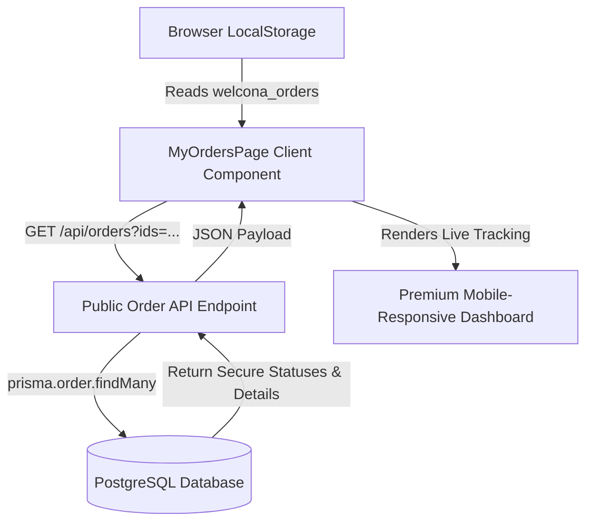

# Guest User Orders Live Tracking & Dynamic Navbar

We have built a secure, live-updating **"My Orders"** tracking dashboard tailored for guest checkouts. The system securely reads order IDs stored in `localStorage` under `welcona_orders`, fetches authenticated status and coordinate details directly from the database server via a public API endpoint, and renders them in a highly responsive mobile-first UI (perfect down to a 320px screen width). 

Additionally, the navbar dynamically hides the tracking link if the customer does not have any orders on their device.

---

## 🛠️ Architecture & Flow

---

## 📋 Features Implemented

### 1. Secure Live Order API Endpoint (`app/api/orders/route.ts`)
- Accepts a query string of order IDs: `GET /api/orders?ids=id1,id2,id3...`
- Securely queries the database for matches and pulls the status, total, order items, product specifications, SKU, and primary images.
- **Client Security:** Prevents any tampering with items, prices, or statuses since details are fetched fresh from the live database.

### 2. Live Order Tracking Page (`app/(users)/my-orders/page.tsx`)
- Reads browser storage. If empty, displays a call to action inviting the guest to shop.
- If order IDs exist, retrieves the authentic state from the database.
- **Mobile Responsive Design:** Designed defensively to scale perfectly on everything from wide desktops to `320px` mobile screens without horizontal clipping.
- **Unified Track Banners:** Displays timelines (`PENDING`, `CONFIRMED`, `SHIPPED`, `DELIVERED`, `CANCELLED`).
- **Wholesale Coordinate Banners:** For pending wholesale orders, highlights a coordinator card with a quick WhatsApp chat action linking directly to your WhatsApp support team.

### 3. Dynamic Navbar Visibility Integration (`components/users/SiteHeader.tsx`)
- Safely reads standard guest records on client load (`useEffect`) to avoid React hydration mismatches.
- Dynamically hides the **"My Orders"** option for cold/new visitors.
- Instantly reveals the **"My Orders"** link on desktop and mobile menus as soon as a successful checkout adds an order to browser memory.
